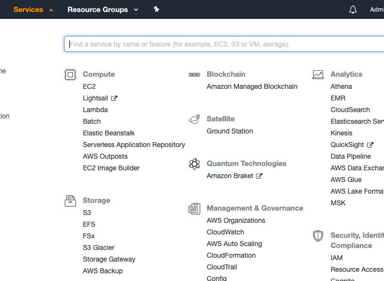
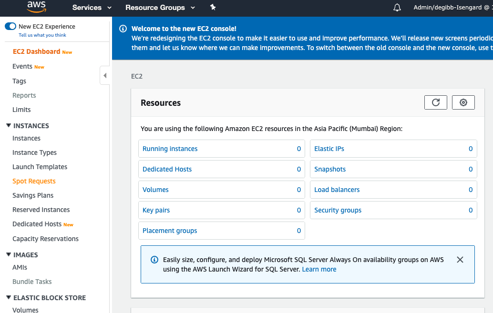
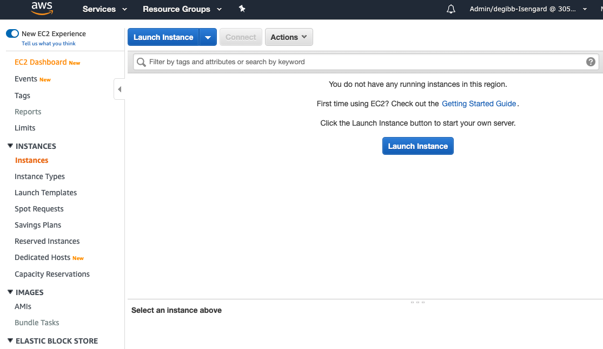
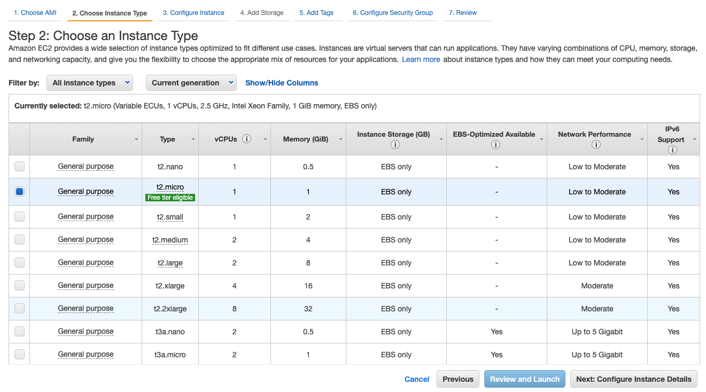
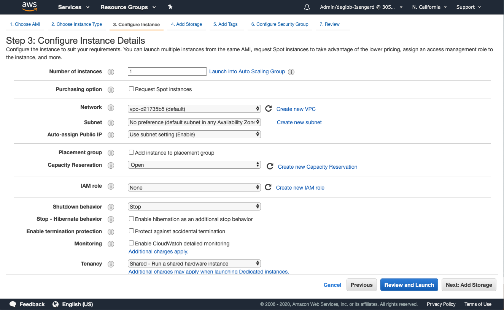
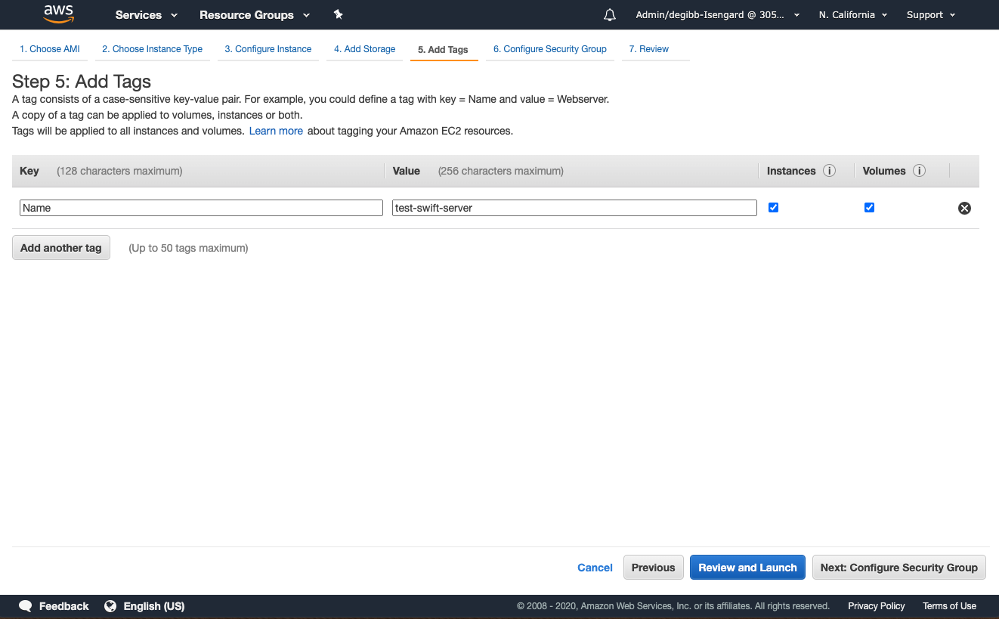
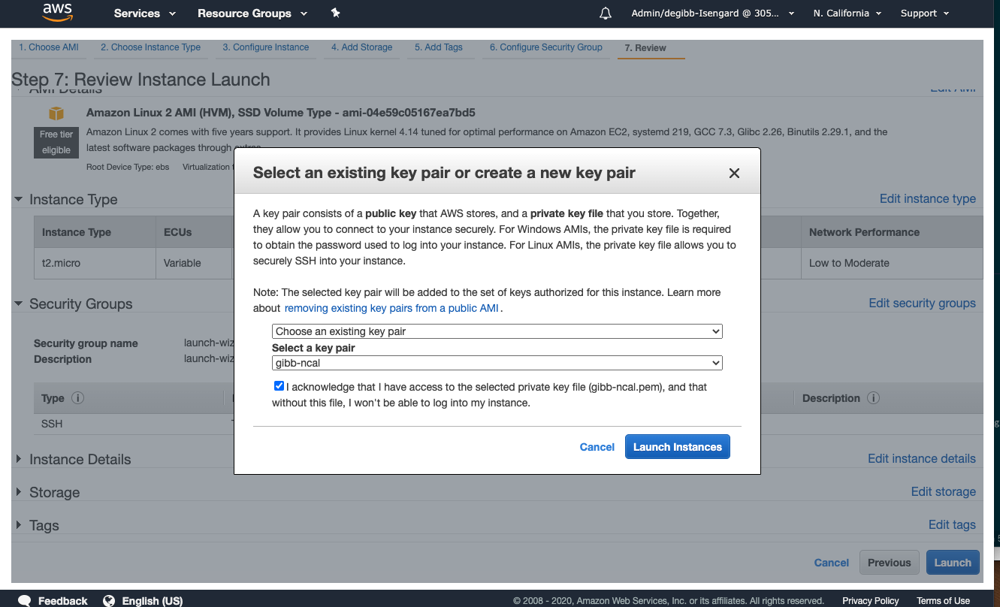
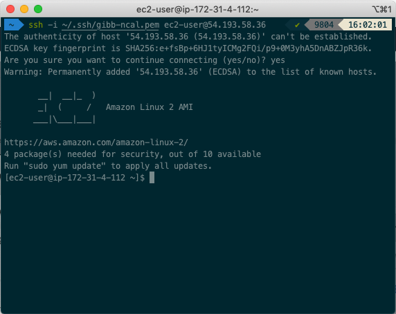
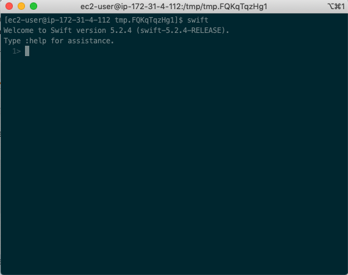
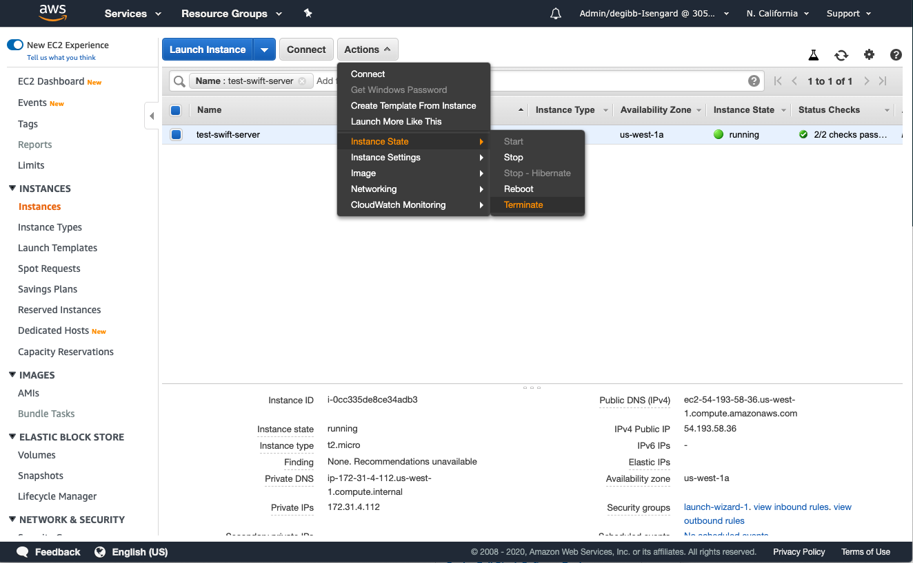

# Deploying to AWS on Amazon Linux 2

This guide describes how to launch an AWS instance running Amazon Linux 2 and configure it to run Swift. The approach taken here is a step by step approach through the console. This is a great way to learn, but for a more mature approach we recommend using Infrastructure as Code tools such as AWS Cloudformation, and the instances are created and managed through automated tools such as Autoscaling Groups. For one approach using those tools see this blog article: https://aws.amazon.com/blogs/opensource/continuous-delivery-with-server-side-swift-on-amazon-linux-2/

## Launch AWS Instance

Use the Service menu to select the EC2 service.



Click on "Instances" in the "Instances" menu



Click on "Launch Instance", either on the top of the screen, or if this is the first instance you have created in the region, in the main section of the screen.



Choose an Amazon Machine Image (AMI). In this case the guide is assuming that we will be using Amazon Linux 2, so select that AMI type.


Choose an instance type. Larger instances types will have more memory and CPU, but will be more expensive. A smaller instance type will be sufficient to experiment. In this case I have a `t2.micro` instance type selected.



Configure instance details. If you want to access this instance directly to the internet, ensure that the subnet that you select is auto-assigns a public IP. It is assumed that the VPC has internet connectivity, which means that it needs to have a Internet Gateway (IGW) and the correct networking rules, but this is the case for the default VPC. If you wish to set this instance up in a private (non-internet accessible) VPC you will need to set up a bastion host, AWS Systems Manager Session Manager, or some other mechanism to connect to the instance.



Add storage. The AWS EC2 launch wizard will suggest some form of storage by default. For our testing purposes this should be fine, but if you know that you need more storage, or a different storage performance requirements, then you can change the size and volume type here.


Add tags. It is recommended you add as many tags as you need to correctly identify this server later. Especially if you have many servers, it can be difficult to remember which one was used for which purpose. At a very minimum, add a `Name` tag with something memorable.



Configure security group. The security group is a stateful firewall that limits the traffic that is accepted by your instance. It is recommended to limit this as much as possible. In this case we are configuring it to only allow traffic on port 22 (ssh). It is recommended to restrict the source as well. To limit it to your workstation's current IP, click on the dropdown under "Source" and select "My IP".


Launch instance. Click on "Launch", and select a key pair that you will use to connect to the instance. If you already have a keypair that you have used previously, you can reuse it here by selecting "Choose an existing key pair". Otherwise you can create a keypair now by selecting "Create a new key pair".



Wait for instance to launch. When it is ready it will show as "running" under "Instance state", and "2/2 checks pass" under "Status Checks". Click on the instance to view the details on the bottom pane of the window, and look for the "IPv4 Public IP".


Connect to instance. Using the keypair that you used or created in the launch step and the IP in the previous step, run ssh. Be sure to use the `-A` option with ssh so that in a future step we will be able to use the same key to connect to a second instance.



We have two options to compile the binary: either directly on the instance or using Docker. We will go through both options here.

## Compile on instance

Run the following command in the SSH terminal. Note that there may be a more up to date version of the swift toolchain. Check https://swift.org/download/#releases for the latest available toolchain url for Amazon Linux 2.

```
SwiftToolchainUrl="https://swift.org/builds/swift-5.4.1-release/amazonlinux2/swift-5.4.1-RELEASE/swift-5.4.1-RELEASE-amazonlinux2.tar.gz"
sudo yum install ruby binutils gcc git glibc-static gzip libbsd libcurl libedit libicu libsqlite libstdc++-static libuuid libxml2 tar tzdata ruby -y
cd $(mktemp -d)
wget ${SwiftToolchainUrl} -O swift.tar.gz
gunzip < swift.tar.gz | sudo tar -C / -xv --strip-components 1
```

Finally, check that Swift is correctly installed by running the Swift REPL: `swift`.



Let's now download and build an test application. We will use the `--static-swift-stdlib` option so that it can be deployed to a different server without the Swift toolchain installed. These examples will deploy SwiftNIO's [example HTTP server](https://github.com/apple/swift-nio/tree/master/Sources/NIOHTTP1Server), but you can test with your own project.

```
git clone https://github.com/apple/swift-nio.git
cd swift-nio
swift build -v --static-swift-stdlib -c release
```

## Compile on Docker

Ensure that Docker and git are installed on the instance:

```
sudo yum install docker git
sudo usermod -a -G docker ec2-user
sudo systemctl start docker
```

You may have to log out and log back in to be able to use Docker. Check by running `docker ps`, and ensure that it runs without errors.

Download and compile SwiftNIO's [example HTTP server](https://github.com/apple/swift-nio/tree/master/Sources/NIOHTTP1Server): 

```
docker run --rm  -v "$PWD:/workspace"  -w /workspace swift:5.4-amazonlinux2   /bin/bash -cl ' \
     swift build -v --static-swift-stdlib -c release
```
## Test binary
Using the same steps as above, launch a second instance (but don't run any of the bash commands above!). Be sure to use the same SSH keypair.

From within the AWS management console, navigate to the EC2 service and find the instance that you just launched. Click on the instance to see the details, and find the internal IP. In my example, the internal IP is `172.31.3.29`

From the original build instance, copy the binary to the new server instance:
```scp .build/release/NIOHTTP1Server ec2-user@172.31.3.29```

Now connect to the new instance:
```ssh ec2-user@172.31.3.29```

From within the new instance, test the Swift binary:
```
NIOHTTP1Server localhost 8080 &
curl localhost:8080
```

From here, options are endless and will depend on your application of Swift. If you wish to run a web service be sure to open the Security Group to the correct port and from the correct source. When you are done testing Swift, shut down the instance to avoid paying for unneeded compute. From the EC2 dashboard, select both instances, select "Actions" from the menu, then select "Instance state" and then finally "terminate".



