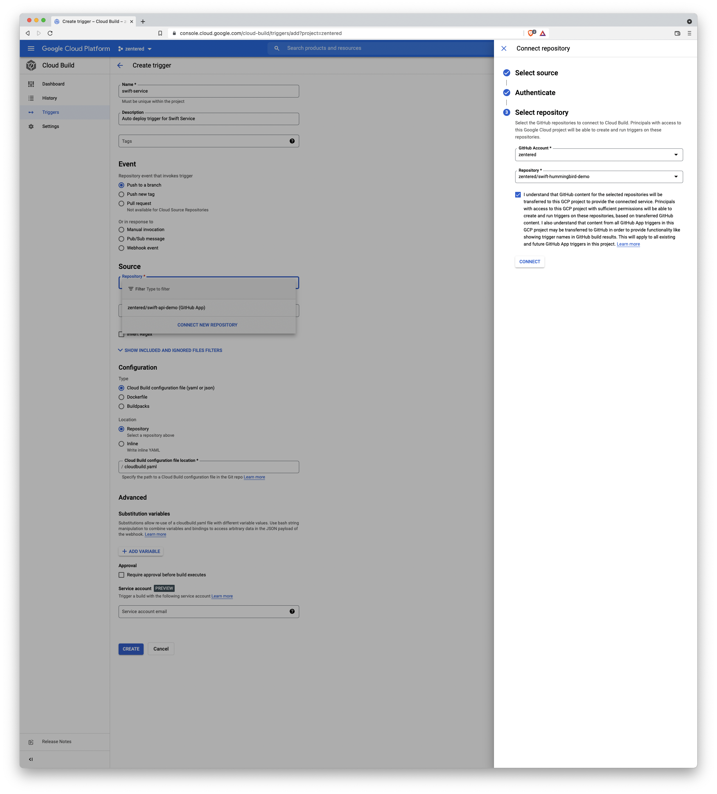
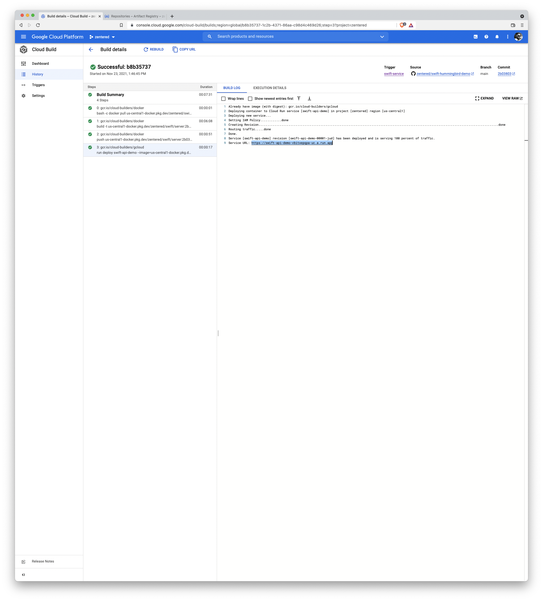
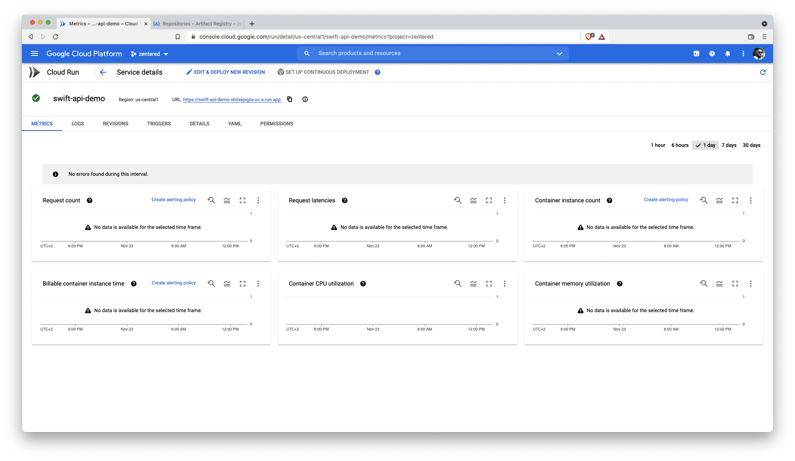

# Deploying to Google Cloud Platform (GCP)

This guide describes how to build and run your Swift Server on serverless
architecture with [Google Cloud Build](https://cloud.google.com/build) and
[Google Cloud Run](https://cloud.google.com/run). We'll use
[Artifact Registry](https://cloud.google.com/artifact-registry/docs/docker/quickstart)
to store the Docker images.

## Google Cloud Platform Setup

You can read about
[Getting Started with GCP](https://cloud.google.com/gcp/getting-started/) in
more detail. In order to run Swift Server applications, we need to:

- enable [Billing](https://console.cloud.google.com/billing) (requires a credit
  card)
- enable the
  [Cloud Build API](https://console.cloud.google.com/apis/api/cloudbuild.googleapis.com/overview)
- enable the
  [Cloud Run Admin API](https://console.cloud.google.com/apis/api/run.googleapis.com/overview)
- enable the
  [Artifact Registry API](https://console.cloud.google.com/apis/api/artifactregistry.googleapis.com/overview)
- [create a Repository in the Artifact Registry](https://console.cloud.google.com/artifacts/create-repo)
  (Format: Docker, Region: your choice)

## Project Requirements

Please verify that your server listens on `0.0.0.0`, not `127.0.0.1` and it's
recommended to use the environment variable `$PORT` instead of a hard-coded
value. For the workflow to pass, two files are essential, both need to be in the
project root:

1. Dockerfile
2. cloudbuild.yml

You should test your Dockerfile with `docker build . -t test` and
`docker run -p 8080:8080 test` and make sure it builds and runs locally.
`cloudbuild.yml` contains a set of steps to build the server image directly in
the cloud and deploy a new Cloud Run instance after the successful build.

_Dockerfile_ is the same as in the [./packaging.md#docker] guide. Replace
`<executable-name>` with your `executableTarget`:

```Dockerfile
#------- build -------
FROM swiftlang/swift:nightly-centos8 as builder

# set up the workspace
RUN mkdir /workspace
WORKDIR /workspace

# copy the source to the docker image
COPY . /workspace

RUN swift build -c release -static-stdlib

#------- package -------
FROM centos:8
# copy executables
COPY --from=builder /workspace/.build/release/<executable-name> /
# copy Swift's dynamic libraries dependencies
COPY --from=builder /usr/lib/swift/linux/lib*so* /

# set the entry point (application name)
CMD ["<executable-name>"]

```

_cloudbuild.yml_. Replace `swift` with your Artifact Registry repository name
and `server` with your service/image name. Replace `us-central1` with the
[region of your choice](https://cloud.google.com/about/locations/).

```yaml
steps:
  - name: 'gcr.io/cloud-builders/docker'
    entrypoint: 'bash'
    args:
      - '-c'
      - |
        docker pull us-central1-docker.pkg.dev/$PROJECT_ID/swift/server:latest || exit 0
  - name: 'gcr.io/cloud-builders/docker'
    args:
      - build
      - -t
      - us-central1-docker.pkg.dev/$PROJECT_ID/swift/server:$SHORT_SHA
      - -t
      - us-central1-docker.pkg.dev/$PROJECT_ID/swift/server:latest
      - .
      - --cache-from
      - us-central1-docker.pkg.dev/$PROJECT_ID/swift/server:latest
  - name: 'gcr.io/cloud-builders/docker'
    args:
      ['push', 'us-central1-docker.pkg.dev/$PROJECT_ID/swift/server:$SHORT_SHA']
  - name: 'gcr.io/cloud-builders/gcloud'
    args:
      - run
      - deploy
      - swift-service
      - --image=us-central1-docker.pkg.dev/$PROJECT_ID/swift/server:$SHORT_SHA
      - --port=8080
      - --region=us-central1
      - --memory=512Mi
      - --platform=managed
      - --allow-unauthenticated
      - --min-instances=0
      - --max-instances=5
images:
  - 'us-central1-docker.pkg.dev/$PROJECT_ID/swift/server:$SHORT_SHA'
  - 'us-central1-docker.pkg.dev/$PROJECT_ID/swift/server:latest'
timeout: 1800s
```

### The steps in detail

1. pull the latest image from the Artifact Registry to retrieve cached layers
2. built the image with `$SHORT_SHA` and `latest` tag
3. push the image to the Artifact Registry
4. deploy the image to Cloud Run

`images` specifies the build images to store in the restristry. The default
`timeout` is 10 minutes, so we'll need to increase it for Swift builds. We use
`8080` as the default port here, it's recommended to remove this line and have
the server listen on `$PORT`.

## Deployment



Push all files to a GitHub or BitBucket (the only two supported providers right
now) and head to
[Cloud Build Triggers](https://console.cloud.google.com/cloud-build/triggers)
and click "Create Trigger":

1. Add a name and description
2. Event: "Push to a branch" is active
3. Source: "Connect New Repository" and authorize with your code provider, add
   the repository where your swift server code is hosted
4. Configuration: "Cloud Build configuration file" / Location: Repository
5. Advanced:
   [Substitution variables](https://cloud.google.com/cloud-build/docs/configuring-builds/substitute-variable-values):
   if you use environment variables for example to connect to a database or 3rd
   party services, you can set the values here. You can also control the build
   arguments such as memory, region etc.
6. "Create"

In the Trigger overview page, you should see your new "swift-service" trigger.
Click on "RUN" on the right to start the trigger manually from the `main`
branch. With a simple Hummingbird project the build takes about 7-8 minutes.
Vapor takes about 25 minutes. After a successful build you should see the
service URL in the build logs:



You can head over to Cloud Run and see your service running there:



The trigger will deploy every new commit on `main`. You can also enable Pull
Request triggers for feature-driven workflows. Cloud Build also allows
blue/green builds, auto-scaling and much more.

You can now connect your custom domain to the new service and go live.

## Cleanup

- delete the Cloud Run service
- delete the Cloud Build trigger
- delete the Artifact Registry repository
